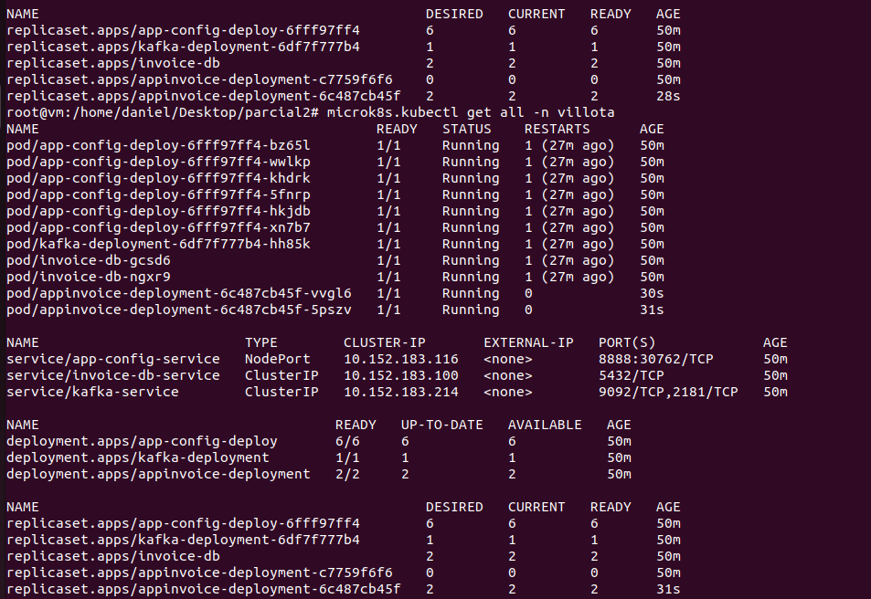

# Jesus Daniel Villota - A00356255

## Commands to get everything running
```
microk8s.kubectl create -f config-deployment-service.yaml

microk8s.kubectl create -f invoicedb-deployment-service.yaml

microk8s.kubectl create -f invoice-deployment.yaml

microk8s.kubectl create -f kafka-deployment.yaml

```

## Pods running



Is everything running as expected and well connected? Only god knows tbh. Amen.
