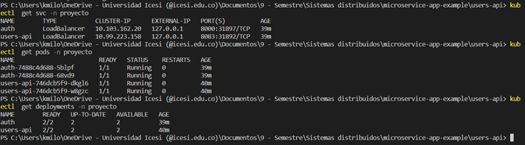
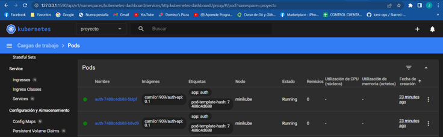
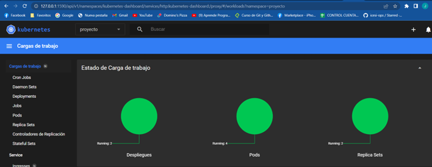
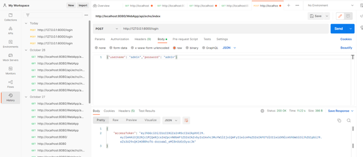
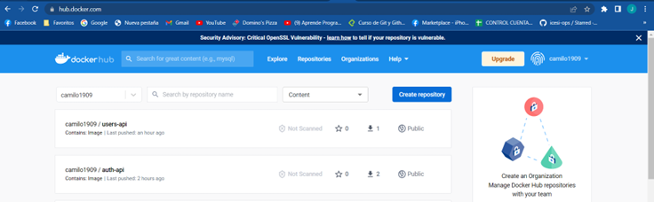

# sd-exam2
<h1 align="center">Developed by Juan Camilo Vargas 💻 </h1>

## Despliegue

Para realizar el despliegue debemos ejecutar los siguientes comandos:
``` bash
# Run
kubectl apply -f auth_api.yml
kubectl apply -f users_api.yml
```
Desplegue el servicio de users para poder realizar la evidencia de que el servicio de auth este funcionando de manera correcta.

## Evidencias

# Consola - PODS - SERVICES - SVC


# Dashboard



# Prueba con el servicio de users


### Imagen Docker Hub


