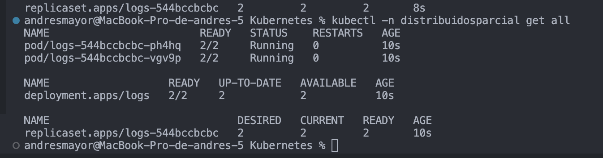
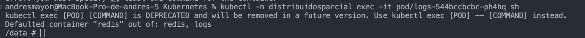

# Parcial 2

## Developed by 🛠️
* **Jaime Andrés Mayor Aldana**  [AndresMayor](https://github.com/AndresMayor)🚀

# Creamos el namespace y ejecutamos el deployment

# Verificamos que los pods esten corriendo

# Ingresamos al contenedor

### Script para iniciar el frontend
    
    kubectl -n distribuidosparcial exec -it pod/logs-544bccbcbc-ph4hq
    

