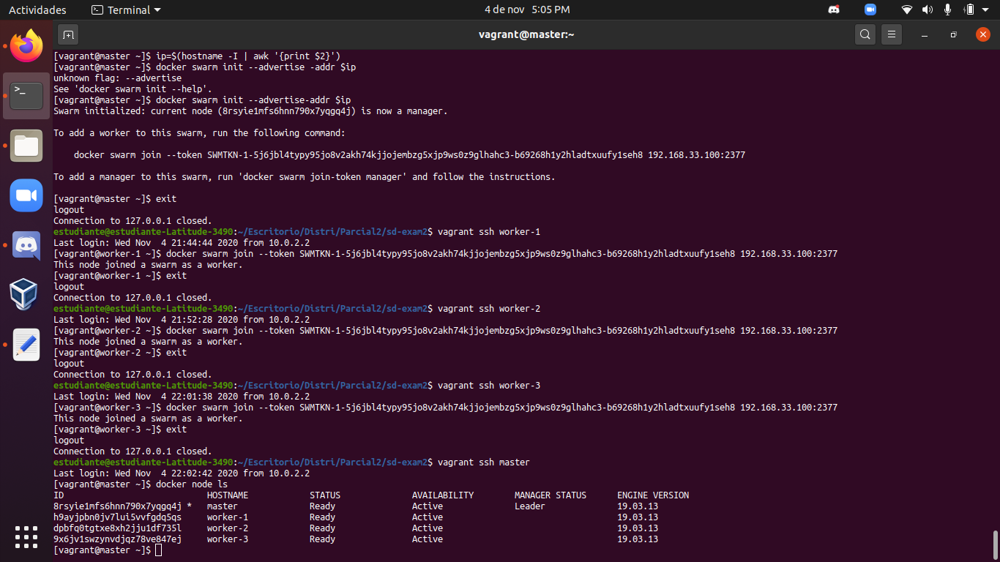

# SISTEMAS DISTRIBUIDOS -  PARCIAL 2 #


### Integrantes ###

 * Daniel Portillo - A00310452
 * Bryan Medina - A00328416 
 * Juan Camilo Calvo - A00030140


### Tecnologias usadas para nuestro desarrollo ###

 * Ansible
 * Sistema operativo bento/ubuntu-18.04/
 * Repositorio de Github
 * MySQL
 * PHP
 * Docker
 * Docker swarm


## Objetivos ##

---

 * Desplegar máquinas virtuales tipo master y worker a través de vagrantfile.
 * Hacer uso de Ansible como herramienta de aprovisionamiento de máquinas virtuales.
 * Asignar volúmenes a las máquinas virtuales a fin de almacenar la informaciòn de la base de datos.
 * Despliegue de una aplicación cuyo backend y base de datos están almacenados en contenedores.
 * Evidenciar la escalabilidad de la aplicación haciendo uso de la herramienta docker swarm.


## Consigna del parcial: ##

---

### Aprovisionamiento del backend ###

**Fuente**
Referencia [Configuracion ansible](https://github.com/icesi-ops/training_IaC/tree/master/Ansible)
Referencia [Configuracion gluster](https://github.com/icesi-ops/training_IaC/tree/master/Vagrant/04_distributed_filesystem)
Referencia [Intalacion dependencias ansible](https://docs.ansible.com/ansible/latest/collections/ansible/posix/mount_module.html)


De acuerdo a los ejemplos desarrollados en clase, se modificaron los archivos ansible y vagrant a fin de llevar a cabo el aprovisionamiento de las máquinas, así: 

Con el archivo Vagrant se asigna la configuración para la creación de las 4 máquinas virtuales, 3 de ellas serán denominadas nodos o workers y una será el maestro o master. A cada una de ellas se les asigna memoria, cpu, sistema operativo. Además, se establece que la herramienta de aprovisionamiento será Ansible y finalmente, se pasa la ruta del archivo .yml encargado de establecer los parámetros de configuración de los servidores php y sql.


```
[Vagranfile master]
firstDisk = './firstDisk.vdi'
secondDisk = './secondDisk.vdi'
thirdDisk = './thirdDisk.vdi'
fourthDisk = './fourthDisk.vdi'
Vagrant.configure("2") do |config|
  config.ssh.insert_key = false

  config.vm.define "master" do |master|
    master.vm.box = "centos/7"
    master.vm.hostname = "master"
    master.vm.network "private_network", ip: "192.168.33.100"
    master.vm.provider "virtualbox" do |vb|
     vb.customize ["modifyvm", :id, "--memory", "512", "--cpus", "1", "--name", "master"]
     unless File.exist?(firstDisk)
      vb.customize ['createhd', '--filename', firstDisk, '--variant', 'Fixed', '--size', 5 * 1024]
    end
    vb.customize ['storageattach', :id,  '--storagectl', 'IDE', '--port', 1, '--device', 0, '--type', 'hdd', '--medium', firstDisk]
    end 
    master.vm.provision "ansible" do |ansible|
      ansible.playbook = "playbooks/confMaster/master.yml"
    end
  end
```

```
[Vagrantfile worker-1]
   config.vm.define "worker-1" do |node1|
     node1.vm.box = "centos/7"
     node1.vm.hostname = "worker-1"
     node1.vm.network "private_network", ip: "192.168.33.11"
     node1.vm.provider "virtualbox" do |vb|
      vb.customize ["modifyvm", :id, "--memory", "512", "--cpus", "1", "--name", "worker-1"]
     unless File.exist?(secondDisk)
        vb.customize ['createhd', '--filename', secondDisk, '--variant', 'Fixed', '--size', 5 * 1024]
      end
     vb.customize ['storageattach', :id,  '--storagectl', 'IDE', '--port', 1, '--device', 0, '--type', 'hdd', '--medium', secondDisk]
     end
     node1.vm.provision "ansible" do |ansible|
      ansible.playbook = "playbooks/confWorkers/worker.yml"
     ansible.groups = {
       "workers" => ["worker-1"]
     }
     end
   end
```

```
[Vagrantfile worker-2]
   config.vm.define "worker-2" do |node2|
     node2.vm.box = "centos/7"
     node2.vm.hostname = "worker-2"
     node2.vm.network "private_network", ip: "192.168.33.12"
     node2.vm.provider "virtualbox" do |vb|
      vb.customize ["modifyvm", :id, "--memory", "512", "--cpus", "1", "--name", "worker-2"]
     unless File.exist?(thirdDisk)
        vb.customize ['createhd', '--filename', thirdDisk, '--variant', 'Fixed', '--size', 5 * 1024]
      end
     vb.customize ['storageattach', :id,  '--storagectl', 'IDE', '--port', 1, '--device', 0, '--type', 'hdd', '--medium', thirdDisk]
     end
     node2.vm.provision "ansible" do |ansible|
      ansible.playbook = "playbooks/confWorkers/worker.yml"
     ansible.groups = {
       "workers" => ["worker-2"]
     }
     end
   end
```

```
[Vagrantfile worker-3]
config.vm.define "worker-3" do |node3|
     node3.vm.box = "centos/7"
     node3.vm.hostname = "worker-3"
     node3.vm.network "private_network", ip: "192.168.33.13"
     node3.vm.provider "virtualbox" do |vb|
      vb.customize ["modifyvm", :id, "--memory", "512", "--cpus", "1", "--name", "worker-3"]
     unless File.exist?(fourthDisk)
        vb.customize ['createhd', '--filename', fourthDisk, '--variant', 'Fixed', '--size', 5 * 1024]
      end
     vb.customize ['storageattach', :id,  '--storagectl', 'IDE', '--port', 1, '--device', 0, '--type', 'hdd', '--medium', fourthDisk]
     end
     node3.vm.provision "ansible" do |ansible|
      ansible.playbook = "playbooks/confWorkers/worker.yml"
     ansible.groups = {
       "workers" => ["worker-3"]
     }
     end
   end
```

Como se mencionó anteriormente, las máquinas son aprovisionadas por medio de Ansible con dos archivos .yml, uno para la maquina master y otro para las máquinas worker.

```
[Ansible master]
- hosts: master
  become: true
  tasks:
   - name: "Install curl"
     yum:
       name: curl
   - name: "download docker.sh"
     shell: "curl -fsSL get.docker.com -o get-docker.sh"
   - name: "permission docker.sh"
     file: 
       path: ./get-docker.sh
       owner: root
       group: root
       mode: 0777
   - name: "Run docker.sh"
     shell: "sudo sh ./get-docker.sh"
   - name: "Usermod"
     shell: "usermod -aG docker vagrant"
   - name: "Start docker"
     service:
      name: docker
      state: started
      enabled: yes
     become: true
   - name: "Install docker-compose"
     shell: "curl -L https://github.com/docker/compose/releases/download/1.27.4/docker-compose-$(uname -s)-$(uname -m) -o /usr/local/bin/docker-compose"
   - name: "chmod +x in /usr/local/bin/docker-compose file"
     file:
       path: /usr/local/bin/docker-compose
       owner: root
       group: root
       mode: "+x"

   - name: copiar carpeta
     copy:
        src: ./webfiles
        dest: .
```


```
[Ansible workers]
- hosts: workers
  become: true
  tasks:
   - name: "Install curl"
     yum:
       name: curl
   - name: "download docker.sh"
     shell: "curl -fsSL get.docker.com -o get-docker.sh"
   - name: "permission docker.sh"
     file:
       path: ./get-docker.sh
       owner: root
       group: root
       mode: 0777
   - name: "Run docker.sh"
     shell: "sudo sh ./get-docker.sh"
   - name: "Usermod"
     shell: "usermod -aG docker vagrant"
   - name: "Start docker"
     service:
      name: docker
      state: started
      enabled: yes
     become: true

```

Para finalizar, dentro del archivo ansible se asigna la ruta que lleva al archivo docker-compose, mediante el cual se correrán los contenedores del backend y de la base de datos de la aplicación.


```
[docker compose]
version: '3'
services:
  mysql:
    container_name: mysql
    restart: always
    image: mysql:5.7
    environment:
      MYSQL_ROOT_PASSWORD: 'secret' # TODO: Change this
    ports:
      - "3306:3306"
    volumes:
      - ./data:/var/lib/mysql
      - ./init.sql:/docker-entrypoint-initdb.d/init.sql
    deploy:
      replicas: 1
      resources:
        limits:
          cpus: "0.1"
          memory: 20M
  php:
    container_name: php
    restart: always
    image: tutum/apache-php
    ports:
      - "80:80"
    volumes:
      - ./html:/var/www/html
    deploy:
      replicas: 1
      resources:
        limits:
          cpus: "0.1"
          memory: 20M
```

### Aprovisionamiento del base de datos ###

**Fuente**
Referencia [Configuracion Base de datos](https://ualmtorres.github.io/SeminarioDockerPresentacion/)

De acuerdo a lo planteado por la fuente y posterior a la integración de los parámetros de creación del contenedor SQL, consignados en el docker-compose  se hace necesario un archivo .sql y uno .php. En el primero, se consignan los datos con los que se quiere inicializar la base de datos.En el segundo, se hace la conexión a la misma, la consulta y la visualización de los datos.


```
[init base de datos]
CREATE SCHEMA IF NOT EXISTS SG;
USE SG;

DROP TABLE IF EXISTS s_customer;
CREATE TABLE s_customer 
 (id                         VARCHAR(3)  NOT NULL,
  name                       VARCHAR(20) NOT NULL,
  phone                      VARCHAR(20) NOT NULL,
  address                    VARCHAR(20),
  city                       VARCHAR(20),
  state                      VARCHAR(15),
  country                    VARCHAR(20),
  zip_code                   VARCHAR(15),
  credit_rating              VARCHAR(9),
  sales_rep_id               VARCHAR(3),
  region_id                  VARCHAR(3),
  comments                   VARCHAR(255),
  CONSTRAINT s_customer_id_pk PRIMARY KEY (id),
  CONSTRAINT s_customer_credit_rating_ck
  CHECK (credit_rating IN ('EXCELLENT', 'GOOD', 'POOR'))
 );


INSERT INTO s_customer VALUES ('301', 'iPhone 12 Pro Max', 'Apple','A14',
'512 GB', '14 MP','4000mA', 'iOS 14','EXCELLENT', '12', '1', NULL);
INSERT INTO s_customer VALUES ('302', 'Mi 10 Pro', 'Xiamoi','Snapdragon',
'256 GB', '108 MP','4400mA', 'Miui 11','EXCELLENT', '14', '1', NULL);
INSERT INTO s_customer VALUES ('303', 'Galaxi S20 ultra', 'Samsung','Exynos 990',
'512 GB', '108 MP','5000mA', 'Android','EXCELLENT', '14', '1', NULL);
INSERT INTO s_customer 
VALUES ('304', 'P40 Pro +', 'Huawei','Kirin 990', '512 GB', '50 MP',
'4000mA', 'Android','EXCELLENT', '12', '1', NULL);

INSERT INTO s_customer VALUES ('305', 'Z flip', 'Samsung','Snapdragon',
'256 GB', '12 MP','4000mA', 'Android','GOOD', '14', '1', NULL);
INSERT INTO s_customer VALUES ('306', 'Galaxy note 10', 'Samsung','Snapdragon',
'256 GB', '16 MP','4400mA', 'Android','GOOD', '12', '1', NULL);

INSERT INTO s_customer VALUES ('215', 'V50', 'Samsung','Snapdragon',
'128 GB', '16 MP', '3500mA', 'Android','POOR', '11', '5', NULL);
COMMIT;

```

```
[php backend]
<!DOCTYPE html>
<html>
<head>
  <meta charset="utf-8">
  <meta http-equiv="X-UA-Compatible" content="IE=edge">
  <title>Compara tu celular</title>
  <link rel="stylesheet" href="https://stackpath.bootstrapcdn.com/bootstrap/4.1.1/css/bootstrap.min.css" integrity="sha384-WskhaSGFgHYWDcbwN70/dfYBj47jz9qbsMId/iRN3ewGhXQFZCSftd1LZCfmhktB" crossorigin="anonymous">
</head>
<body>
  <div class = "container">
    <div class="jumbotron">
      <h1 class="display-4">Ranking app</h1>
      <p class="lead">Conoce como esta calificado tu celular</p>
      <hr class="my-4">
      <p></p>
    </div>
    <table class="table table-striped table-responsive">
      <thead>
        <tr>
          <th>Modelo</th>
          <th>Calificaciòn</th>
          <th>Procesador</th>
          <th>Capacidad</th>
          <th>Mejor càmara</th>
          <th>Capacidad de la baterìa</th>
          <th>Sistema operativo</th>
        </tr>
      </thead>
      <tbody>
        <?php
        $conexion = mysql_connect("mysql", "root", "secret");
        mysql_select_db("SG", $conexion);

        $cadenaSQL = "select * from s_customer";
        $resultado = mysql_query($cadenaSQL);

```

**Evidencia de Funcionamiento**

Para poder realizar el discovery service de docker swarm, primero se debe realizar la siguiente configuracion.



Como servicio escogido para desarrollar la aplicación se muestra una página donde se presentan características de diferentes modelos y marcas de celulares, dentro de las que se destaca una calificación dependiendo de aspectos como su capacidad, cámara, procesador, etc.


### Tareas de integracion ###

Para esta tarea se decidió realizar la estrategia de branching **Trunk Base Development**, ya que esta estrategia nos permite trabajar de una manera más cómoda dada la cantidad de personas en  el grupo de trabajo (3 Personas). Además, es una estrategia de branching buena para nosotros ya que estamos iniciando a trabajar en equipo en un repositorio remoto, ya que esta cuenta como máximo con 3 ramas largas, y nos permite realizar iteraciones y pruebas en la rama master con mayot velocidad.

Para implementar esta estrategia primero se hace un fork desde uno de los repositorios de los integrantes al repositorio donde se quiere subir las evidencias del examen. Posteriormente los otros integrantes hacen un git clone el repositorio que fue forkeado; cada uno de los integrantes crea una nueva rama, donde trabaja alguna función por aparte, y posteriormente todo se mezcla en la rama master para finalmente hacer un merge.

**Evidencias:** [Github](https://github.com/juancal97/sd-exam2)

### Recopilacion de Errores ###

 * No actualización de los datos modificados en el init: es tal vez el principal problema al que nos vimos enfrentados debido a que cuando modificamos un dato, fuera cual fuera e intentábamos recargar la pagina esta se mostraba sin información. Como solución se encontró: eliminar los archivos, detener los contenedores, editar la información y cargarlos de nuevo.

 * Se tenia el siguiente error al realizar el vagrant up.


   
   para solucionarlo se realizo lo siguiente se corrio el comando *ansible-galazy collection install ansible.posix* previo a relizar el vagrant up, para instalar dependencias.
Referencia [instalar dependencias de ansible](https://docs.ansible.com/ansible/latest/collections/ansible/posix/mount_module.html)

 * Al correr el docker-compose, se tenia el siguiente error en algunos computadores, lo que impedia que se inicializara la base de datos.


