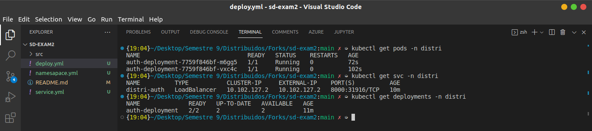

# sd-exam2
---

PageTitle: Parcial 2 - Sistemas Distribuidos - Icesi

Author: "Juan David Ballesteros"

Date: "31/10/2022"

---

Pasos del despliegue

En este repositorio se encontrarán tres archivos, en este caso el orden de ejecución es relevante, a continuación se presenta el orden y los comandos a correr desde el directorio raiz:

1. Se levanta el namesapace:

    ` kubectl apply -f ./namesapace.yml `

2. Se levanta el despliegue:

    ` kubectl apply -f ./deploy.yml -n distri `

3. Se levanta el servicio tipo LB:

    ` kubectl apply -f ./service.yml -n distri `

--- 

## Pruebas del despliegue:

### Dashboard

### Terminal

### Disponibilidad

Cabe aclarar que la petición falla, ya que este servicio depende de otros

---

Docker image

[Enlace a la imagen](https://hub.docker.com/r/juanballesteros/auth_distri)

Pull de la imagen: 
`docker pull juanballesteros/auth_distri`